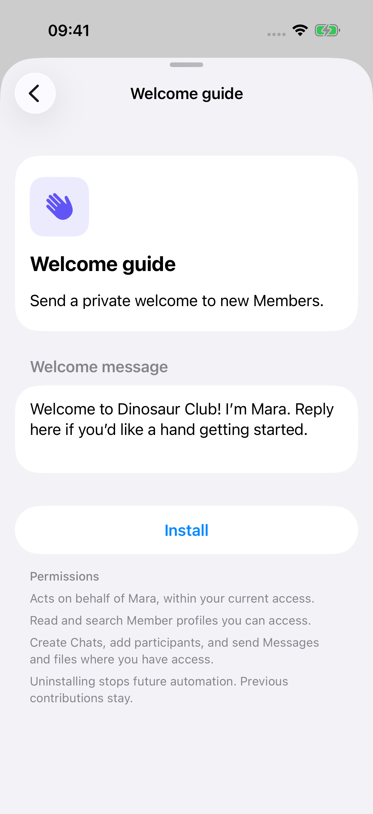
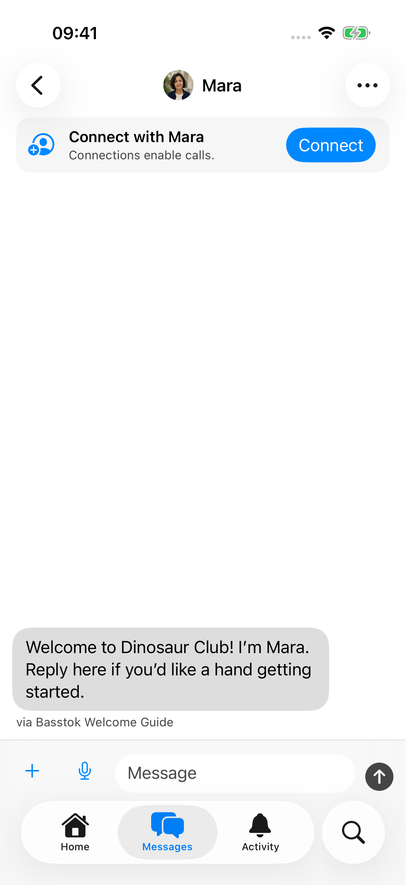

# Basstok Agents

Welcome new Members. Run a poll. Bring a good discussion into view.

Install an Agent in [Basstok](https://basstok.com/), run one yourself, or write
your own. Agents are small external programs using the Basstok REST API with
explicit permission.

[Meet the five Agents](official-agents.md) · [Get started](getting-started.md) · [Browse the code](https://github.com/basstok/agents)

## A warm welcome, written by you

Write your welcome message once. Welcome guide sends it when a new Member
joins, with you as the sender and the Agent clearly identified.

<div class="agent-photos">
  
  
</div>

[See Help desk, Quick polls, Discussion closeout, and Community favorites →](official-agents.md)

Want to add guidance to selected discussions? Run
[Discussion guide](getting-started.md#discussion-guide) with your own Markdown
instructions. It adds one helpful Comment per post and selected Label.

## A useful Agent stays small

Feature selected Content after five reactions:

```ts
await serveAgent({
  name: "Community favorites",
  onContentChanged: async (content, api) => {
    if (content.labels.some(({ id }) => id === favoritesLabelId) &&
        !content.system_labels.includes("featured") &&
        (await api.getReactionSummary(content.id)).total_count >= 5) {
      await api.setFeatured(content.id, true);
    }
  },
});
```

[Get started](getting-started.md) with Welcome guide, or
[write your own Agent](writing-an-agent.md).

## Access you choose

Every Agent needs explicit permission and acts within its responsible Member’s
current access. Review permissions before installing. Uninstall from the same
place to stop future actions; your community continues without the Agent.
