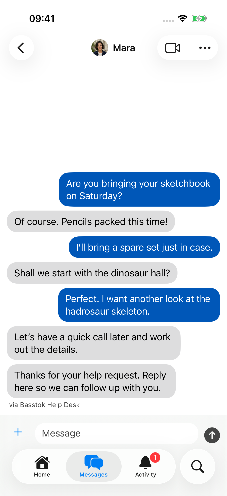
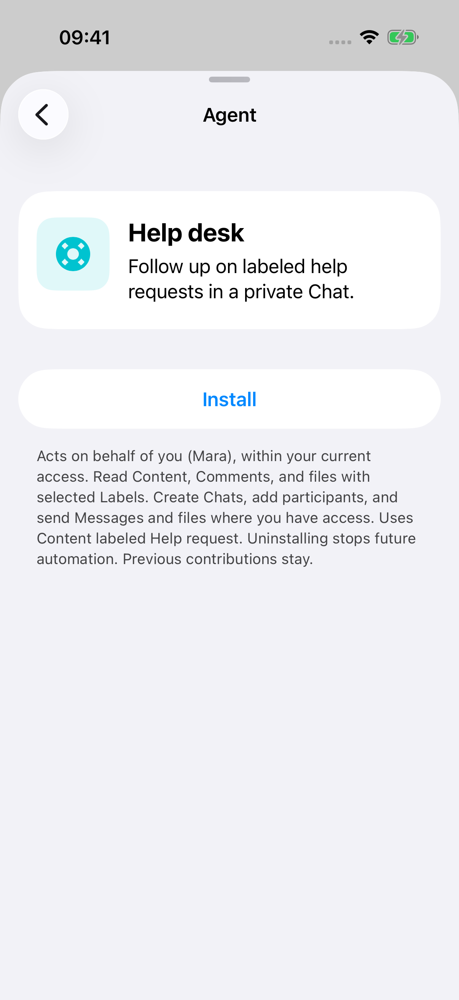
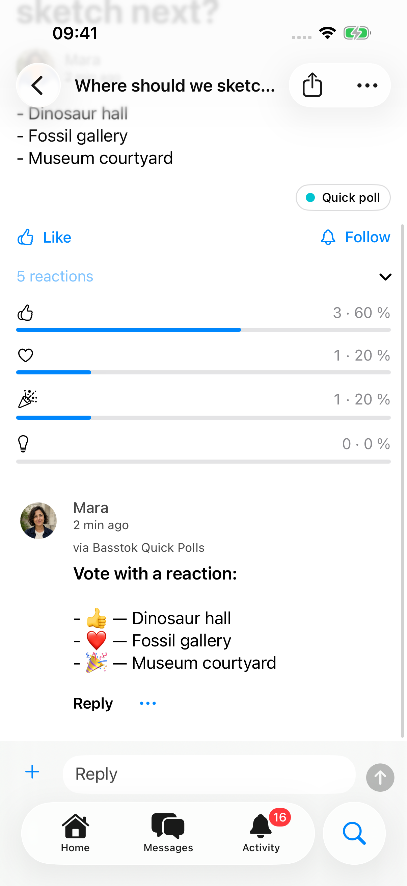
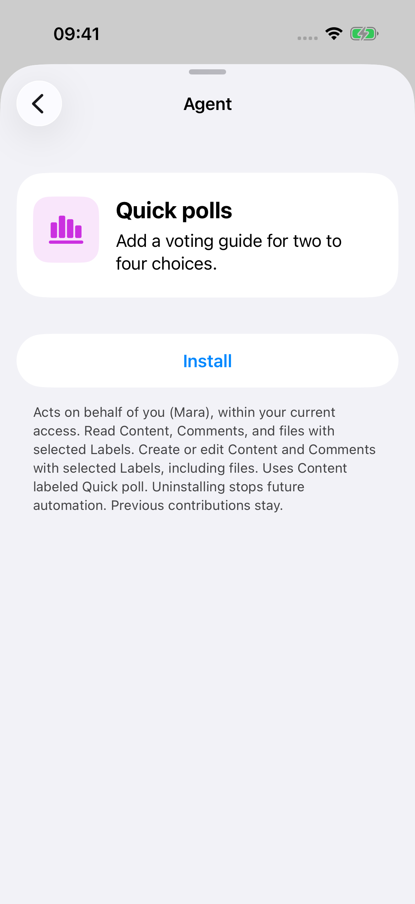
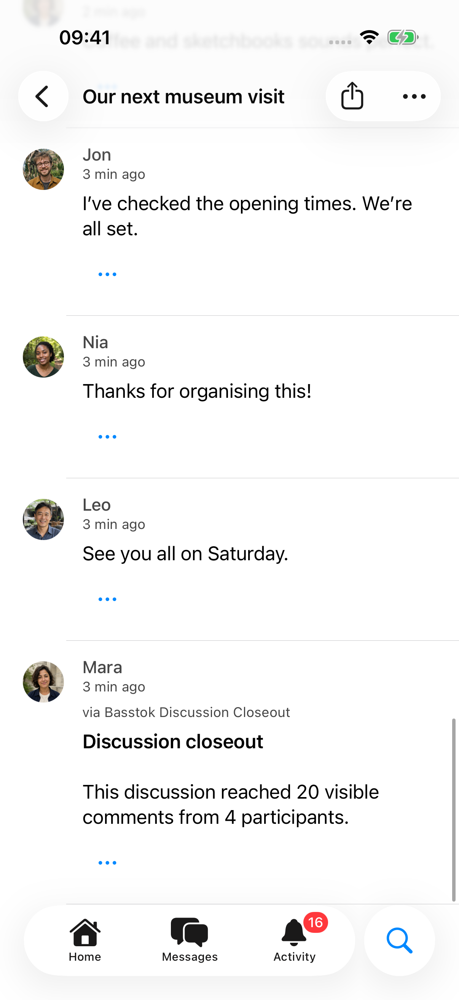
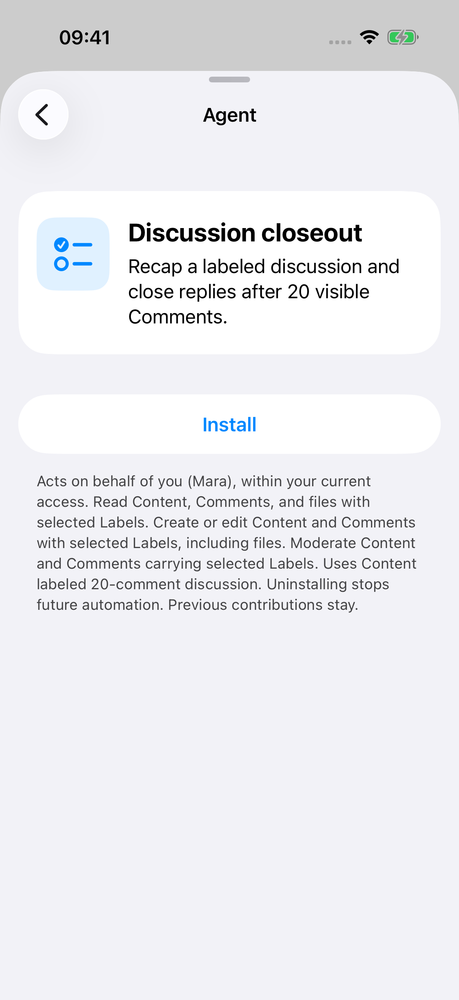
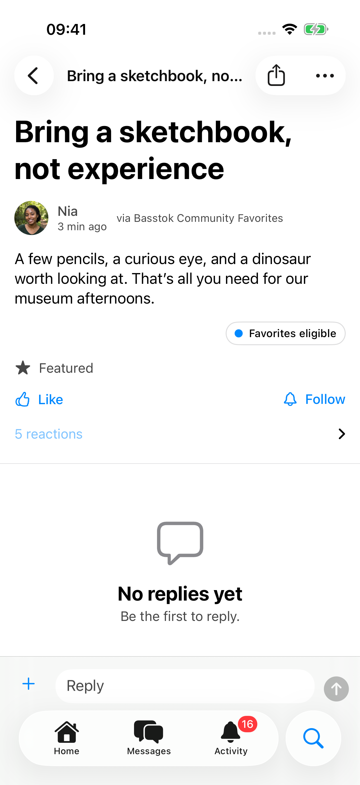
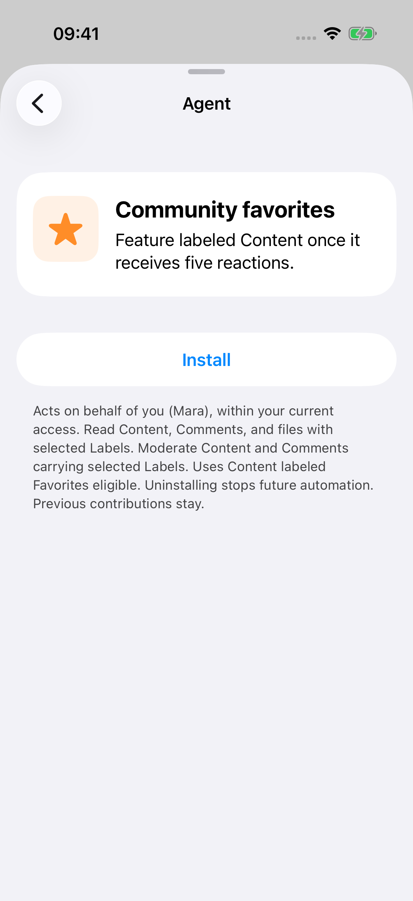

# Official Agents

Five Basstok-maintained Agents you can install in your community or
[run yourself](https://github.com/basstok/agents/tree/main/agents).

## Welcome guide

Send new Members a direct welcome from the responsible Member. Welcome guide
creates or reuses their direct Chat and sends one welcome Message. It skips
the responsible Member and Members created by Agents.

Write your welcome message before installing. New Members receive it from
you, with Welcome guide identified below the Message.

  
  

## Help desk

Add the **Help request** Label to Content to start a private follow-up with its
author. Help desk opens or reuses a direct Chat and sends one acknowledgment
for that request. Requests authored by the responsible Member are skipped.

  
  

## Quick polls

Publish two to four Markdown bullet choices and add the **Quick poll** Label.
Quick polls adds a Comment explaining which Content reaction represents each
choice: 👍, ❤️, 🎉, then 💡.

Use only the choice list in the body. The first guide stays unchanged if you
edit the choices later.

  
  

## Discussion closeout

Add the **20-comment discussion** Label to give a discussion a clear stopping
point. After 20 visible Comments, the Agent adds a participation recap and
pauses replies. Hidden or withheld Comments and their reply subtrees do not
count. It does not replace an existing edited recap.

  
  

## Community favorites

Add the **Favorites eligible** Label to Content you want the community to help
surface. Once it receives five reactions, the Agent features it. It stays
featured if the reaction count later falls.

  
  

## Install or uninstall

As a Manager, open **Account → Agents** on iPhone or Android, or
**Account → Administration → Agents** on the web. Choose an Agent and review
its permissions before installing it. Content Agents use the corresponding Label
to select the Content they can access.

Uninstall an Agent on the same page to stop future actions and event delivery.
Uninstalling does not undo work already completed. Your community remains
usable if an Agent is stopped or unavailable.

Client developers can use the [Agent management endpoints](https://github.com/basstok/api/blob/main/reference.md#manage-official-agents).
These require a Manager's session, not an Agent token.

## Run your own copy

[Get the code and connect](getting-started.md), choosing the Agent with `--agent`:

| Agent | Command name | Permissions |
|---|---|---|
| Welcome guide | `welcome-guide` | `member:read chat:write` |
| Help desk | `help-desk` | `content:read chat:write` |
| Quick polls | `quick-polls` | `content:read content:write` |
| Discussion closeout | `discussion-closeout` | `content:read content:write moderation:write` |
| Community favorites | `community-favorites` | `content:read moderation:write` |

For Content Agents, [select the Label on the grant](connecting.md#select-content-resources)
and set its ID as described in [Choose another Agent](getting-started.md#choose-another-agent).
Official and independently operated Agents use the same public API and permission rules.
